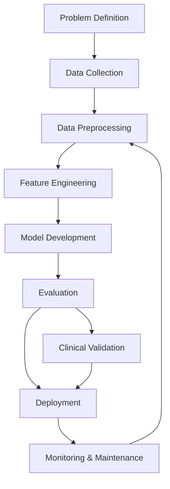

# AI Development Workflow — Assignment

Course: AI for Software Engineering
Duration: 7 days
Total Points: 100

## Title
Predicting 30-Day Patient Readmission: An AI Development Workflow Case Study

## Abstract
This document applies the AI Development Workflow to a hypothetical healthcare problem: predicting patient readmission within 30 days of hospital discharge. The report includes short-answer questions (Part 1), a focused case study (Part 2), critical thinking about ethics and trade-offs (Part 3), and a reflection plus a workflow diagram (Part 4). The report is structured to meet the assignment rubric and contains references and reproducible code in the accompanying repository.

---

## Contents
- Part 1: Short Answer Questions
- Part 2: Case Study Application
- Part 3: Critical Thinking
- Part 4: Reflection & Workflow Diagram
- References

---

## Part 1: Short Answer Questions (30 points)

### 1. Problem Definition (6 points)
Problem: Predicting 30-day patient readmission risk for discharged inpatients.

Objectives (3):
1. Reduce preventable 30-day readmissions by identifying high-risk patients before discharge.
2. Provide interpretable risk scores and actionable features to clinicians (e.g., medication complexity, comorbidity burden).
3. Integrate predictions into discharge planning to recommend follow-up interventions (call, home visit, medication reconciliation).

Stakeholders (2):
- Hospital clinicians and care-coordinators (clinical decision-making and interventions).
- Patients and caregivers (benefit from reduced readmission and improved continuity of care).

KPI (1):
- Area Under the Receiver Operating Characteristic curve (ROC-AUC) on held-out test data to measure discriminatory power. Additionally track reduction in actual 30-day readmission rate post-deployment as an operational KPI.

### 2. Data Collection & Preprocessing (8 points)
Data sources (2):
1. Electronic Health Records (EHR): diagnoses (ICD codes), labs, vitals, medication orders, procedures, length-of-stay, prior admissions.
2. Administrative and social determinants: demographic data, insurance type, ZIP-code-level socioeconomic indicators, care-availability (primary care visits), and telehealth access.

Potential bias (1):
- Sampling bias: the training data may overrepresent certain demographic groups (e.g., patients from areas with better access to the hospital), causing worse performance for underrepresented groups and amplifying health disparities.

Preprocessing steps (3):
1. Missing data handling: impute missing labs using clinically-aware strategies — e.g., mean or median where appropriate, or indicator variables for "not measured" when absence is informative.
2. Normalization and scaling: scale continuous features (standard scaler) to help model convergence and ensure meaningful coefficient comparability for linear models.
3. Categorical encoding and feature engineering: group rare diagnosis codes into higher-level categories; encode categorical variables with target-encoding or one-hot encoding depending on model choice. Create features like comorbidity index (e.g., Charlson score), recent prior admissions count, and medication complexity score.

### 3. Model Development (8 points)
Model choice:
- Logistic Regression with regularization (L2) or Gradient Boosted Trees (e.g., XGBoost). Justification: Logistic Regression offers interpretability—clinically useful coefficients and simple probability outputs; Gradient Boosted Trees often provide higher accuracy on structured tabular data and can handle nonlinearities and interactions without heavy feature transformation.

Data split:
- Split data chronologically if possible (train on older discharges, validate/test on more recent discharges) to mimic deployment and avoid information leakage. Typical split: 70% train, 15% validation, 15% test. If time splitting is not possible, use stratified random split ensuring class balance.

Hyperparameters to tune (2):
1. Regularization strength (C) for Logistic Regression — controls model complexity and helps prevent overfitting.
2. Learning rate and number of estimators for Gradient Boosted Trees — trade-off between underfitting and overfitting; learning rate controls incremental updates and number of estimators controls model capacity.

### 4. Evaluation & Deployment (8 points)
Evaluation metrics (2):
1. Precision-Recall (PR) curve / Average Precision: because the positive class (readmission) is often rarer, precision and recall emphasize performance on the minority class.
2. ROC-AUC: provides a threshold-agnostic measure of discrimination between classes.

Concept drift and monitoring:
- Concept drift: when the joint distribution of inputs and/or labels changes over time (e.g., new treatment protocols, seasonal variation, changes in patient mix). Monitor drift with statistical tests (population stability index, KL divergence) on feature distributions and track model performance metrics (AUC, precision/recall) over time. Implement periodic model retraining triggers and data validation alerts.

Deployment challenge (1):
- Scalability and latency: integrating real-time prediction into EHR requires low-latency APIs and robust access control. Ensuring the model can handle concurrent requests or batch-scoring large daily discharges while maintaining security and audit logging is a technical challenge.

---

## Part 2: Case Study — Hospital Readmission (40 points)

### Problem Scope (5 points)
Problem: Predict which patients are likely to be readmitted within 30 days of discharge to enable targeted interventions.

Objectives:
- Accurately stratify patients into risk tiers (low, medium, high).
- Provide actionable explanations that clinicians can act on (top contributing features).
- Reduce preventable readmissions by 10% within one year of deployment.

Stakeholders:
- Clinical staff (physicians, nurses, discharge planners).
- Hospital administrators and quality improvement teams.
- Patients and payers (insurance agencies interested in readmission penalties).

### Data Strategy (10 points)
Data sources:
1. EHR structured data: demographics, diagnoses, procedures, lab results, vitals, orders, medication lists, length of stay, discharge disposition.
2. Historical utilization and administrative data: prior admission counts, outpatient visits, insurance type, appointment adherence.

Ethical concerns (2):
1. Patient privacy and data protection: ensuring all PHI is handled and stored per HIPAA and local regulations. Minimize data exposure and apply de-identification for research copies.
2. Equity and bias: model may under-predict risk for populations historically underserved in the data; interventions based on biased predictions could worsen outcomes.

Preprocessing pipeline (feature engineering included):
1. Data extraction: securely query EHR for discharge events, join with prior admissions and outpatient records.
2. Cleaning: remove duplicate records, normalize date formats, and align lab units.
3. Missingness handling: create missing indicators for labs/vitals; impute using clinically-informed values (median or conditional imputation based on subgroup).
4. Feature engineering:
   - Comorbidity index: compute Charlson or Elixhauser score from diagnosis codes.
   - Recent utilization: count admissions and ED visits in last 6/12 months.
   - Medication complexity: number of active medications and high-risk medication flags.
   - Social risk proxies: use ZIP-code level SDOH indices and insurance type as proxies where permitted.
5. Encoding and scaling: one-hot or target encoding for categorical codes; standard scale continuous features.
6. Label engineering: define readmission within 30 days post-discharge; exclude planned readmissions by filtering procedure codes when possible.

### Model Development (10 points)
Model selection and justification:
- Gradient Boosted Trees (XGBoost / LightGBM). Justification: strong performance on structured clinical data, handles missingness out-of-the-box, captures nonlinearities and interactions, and supports feature importance for interpretability tools (SHAP).

Hypothetical confusion matrix and calculations:
Assume on test set of 1000 patients, actual readmissions = 150.
Predictions at chosen threshold produce:
- True Positives (TP) = 90
- False Positives (FP) = 60
- False Negatives (FN) = 60
- True Negatives (TN) = 790

Confusion matrix:
|               | Predicted Readmit | Predicted Not Readmit |
|---------------|-------------------:|----------------------:|
| Actual Readmit| 90 (TP)            | 60 (FN)               |
| Actual No     | 60 (FP)            | 790 (TN)              |

Precision = TP / (TP + FP) = 90 / (90 + 60) = 0.6 (60%)
Recall = TP / (TP + FN) = 90 / (90 + 60) = 0.6 (60%)
F1-score = 2 * (precision*recall) / (precision + recall) = 0.6

Interpretation: At this threshold the model identifies 60% of readmissions while 40% of flagged patients are false positives. Threshold selection depends on clinical resource availability and cost of interventions.

### Deployment (10 points)
Integration steps:
1. Packaging: wrap the trained model as a versioned artifact (pickle or joblib), store in a secure model registry with metadata.
2. API layer: deploy a RESTful prediction service behind hospital firewall that receives patient discharge data and returns risk score and top contributing features (e.g., SHAP values).
3. EHR integration: build an interface (SMART on FHIR app or native EHR integration) that displays risk and care recommendations in clinician workflows.
4. Logging and auditing: persist predictions, inputs (hashed or de-identified), user interactions, and ground-truth outcomes for monitoring and model retraining.
5. Monitoring and feedback loop: collect labels, performance metrics, and trigger retraining when performance drops.

Compliance with healthcare regulations (HIPAA):
- Data minimization: only transmit necessary fields for scoring; use de-identified or hashed identifiers where possible.
- Access control: role-based access to prediction outputs; encryption in transit (TLS) and at rest.
- Audit logs: maintain access and prediction logs for compliance reviews.
- Business Associate Agreements: ensure third-party vendors (if any) comply with HIPAA.

### Optimization (5 points)
Method to address overfitting:
- Use k-fold cross-validation with early stopping for gradient boosted trees and regularization parameters (max_depth, min_child_weight). Additionally, apply feature selection and monitor validation performance; use ensembling or model calibration only when generalization improves.

---

## Part 3: Critical Thinking (20 points)

### Ethics & Bias (10 points)
How biased training data affects outcomes:
- If minority groups are underrepresented or historically receive lower-quality care, the model may underpredict risk for these groups. As a result, these patients may not receive needed interventions, exacerbating health disparities.

Mitigation strategy (1):
- Implement fairness-aware evaluation and mitigation: measure performance stratified by protected attributes (race, age, gender). Use reweighting or adversarial debiasing during training or post-processing calibration to equalize false negative rates across groups. Importantly, pair algorithmic outputs with clinician oversight and track real-world outcomes after deployment.

### Trade-offs (10 points)
Interpretability vs. accuracy in healthcare:
- Highly interpretable models (e.g., logistic regression, decision rules) allow clinicians to understand predictions and trust recommendations, which is crucial for adoption in high-stakes settings. More complex models (e.g., ensembles, deep learning) might achieve higher accuracy but can be opaque.
- In healthcare, a modest gain in accuracy may not justify a large drop in interpretability if clinicians cannot validate or act on recommendations. A pragmatic approach is to use a high-performance model paired with explanation tools (SHAP) and validate explanations clinically.

Impact of limited compute resources on model choice:
- Limited resources favor lightweight models (logistic regression, small decision trees) or quantized/ distilled models. It may also steer toward batch scoring (overnight) rather than real-time inference. If real-time is required, consider model compression, pruning, or using cloud-hosted inference with proper security and cost controls.

---

## Part 4: Reflection & Workflow Diagram (10 points)

### Reflection (5 points)
Most challenging part:
- Balancing model performance with fairness and clinical interpretability. The tension between optimizing predictive metrics and ensuring equitable, explainable recommendations for clinicians makes design choices complex.

Improvements with more time/resources:
- Acquire more diverse, multi-institutional data to improve generalizability; perform prospective validation; add clinician-in-the-loop evaluations and randomized trials to measure actual patient outcomes.

### Diagram (5 points)
A flowchart of the AI Development Workflow (Mermaid diagram). Save as `workflow` in the report — convert to PDF-friendly rendering when exporting.

---

## References
- Kuhn, M., & Johnson, K. (2019). Feature Engineering and Selection. CRC Press.
- Chawla, N. V., et al. (2002). SMOTE: Synthetic Minority Over-sampling Technique. Journal of Artificial Intelligence Research.
- Lundberg, S. M., & Lee, S.-I. (2017). A Unified Approach to Interpreting Model Predictions. NIPS. (SHAP)
- U.S. Department of Health & Human Services. HIPAA for Professionals. https://www.hhs.gov/hipaa/index.html

---

## Submission notes
- This Markdown file (`report.md`) is the source for the PDF; convert to PDF (Pandoc, or export from VS Code markdown preview) to satisfy the PDF submission requirement.
- Code and runnable pipeline are in `code/` — see `README.md` for instructions.

End of report.
